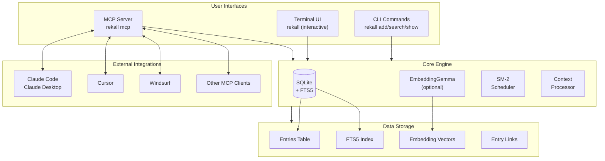
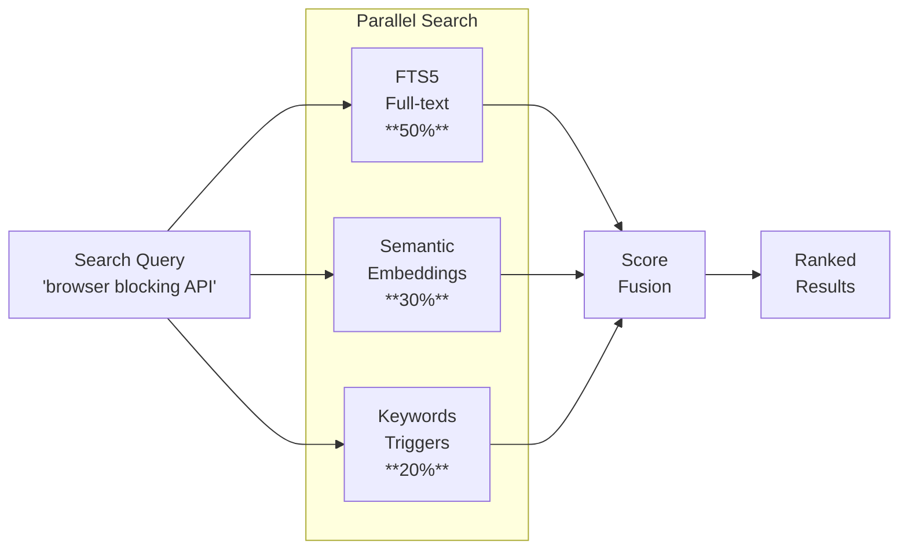
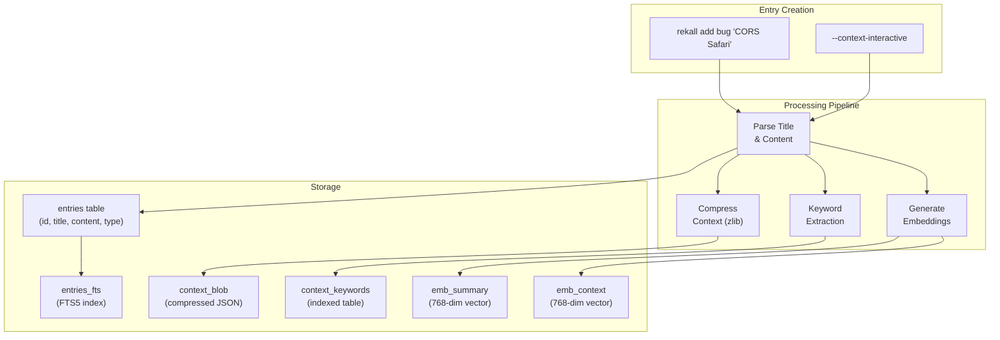
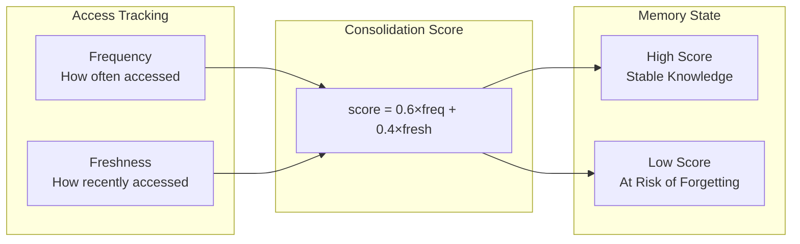
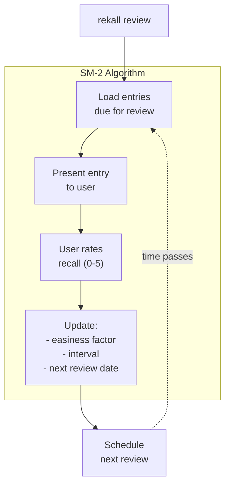
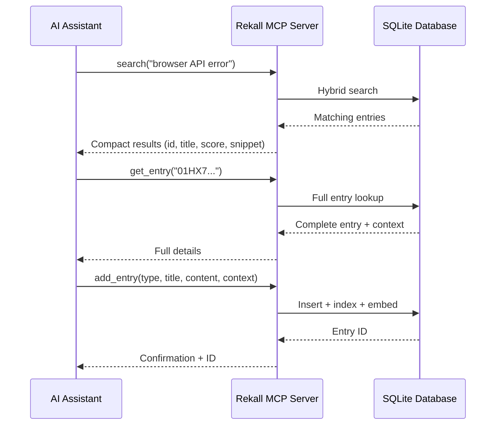
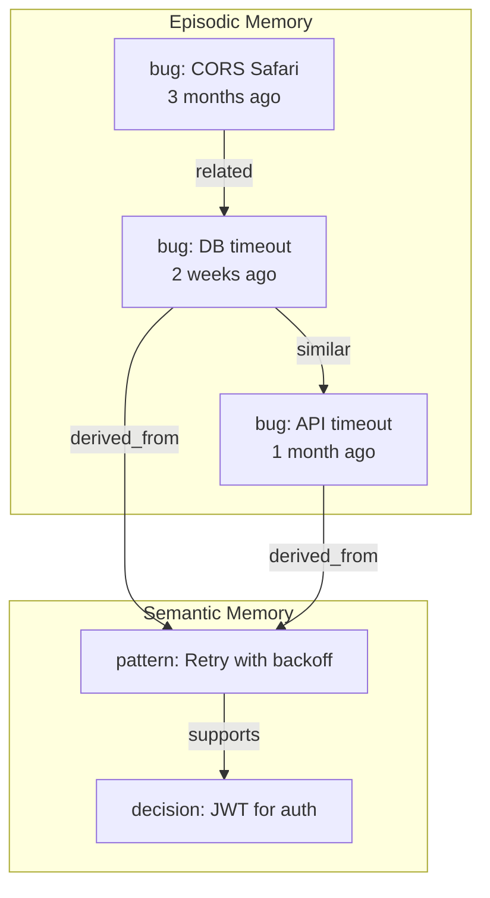

# Rekall Architecture

This document provides detailed technical diagrams of Rekall's architecture.

## System Overview



## Hybrid Search Pipeline



### Search Strategy Details

| Strategy | Weight | How it works |
|----------|--------|--------------|
| **FTS5** | 50% | SQLite full-text search with BM25 ranking. Finds exact and partial word matches. |
| **Semantic** | 30% | EmbeddingGemma creates 768-dim vectors. Cosine similarity finds conceptually related content. |
| **Keywords** | 20% | Structured context keywords provide explicit triggers (`cors`, `safari`, `timeout`). |

## Entry Data Flow



## Memory Consolidation Model



## SM-2 Spaced Repetition



## MCP Server Protocol



## Knowledge Graph Structure



## File Structure

```
~/.local/share/rekall/
├── rekall.db              # SQLite database
│   ├── entries            # Main entries table
│   ├── entries_fts        # FTS5 full-text index
│   ├── entry_links        # Entry relationships
│   ├── context_keywords   # Keyword index
│   └── embeddings         # Vector storage (if enabled)
├── config.toml            # User configuration
└── backups/               # Automatic backups
```

## Configuration Options

```toml
# ~/.local/share/rekall/config.toml

[embeddings]
enabled = false              # Enable semantic search
model = "embedding-gemma"    # Model to use

[search]
fts_weight = 0.5            # Full-text search weight
semantic_weight = 0.3       # Semantic search weight
keyword_weight = 0.2        # Keyword trigger weight

[review]
algorithm = "sm2"           # Spaced repetition algorithm
default_easiness = 2.5      # Starting easiness factor
```
